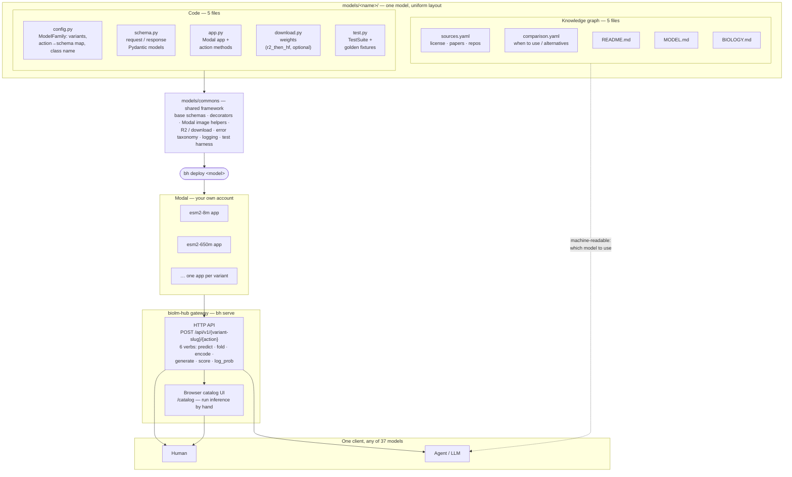

# Architecture — the uniform substrate

Every model is the same ten files in the same layout. `models/commons` supplies the
shared framework, `bh deploy` ships each variant to *your* Modal account, and the
`biolm-hub` gateway exposes them all behind one HTTP contract and one browser UI.
Same layout, same six verbs, same schemas — **learn one model, use all 37.**

*The diff between any two models is the science, never the plumbing — so an agent that
learns one model can call, compare, and even add another.*
