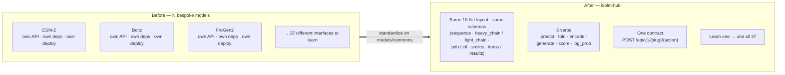

# N bespoke APIs → 1 schema + 6 verbs

Open bio-ML models each arrive as their own research code: a different interface, a
different dependency mess, a different one-off serving story. biolm-hub collapses all of
it onto one substrate — the biology moves into metadata and tags, the plumbing becomes
uniform.

Prefer plain text? The same payoff, as a table:

| | Before (per model) | After (biolm-hub) |
|---|---|---|
| **Layout** | ad-hoc, per repo | identical 10-file directory |
| **Interface** | bespoke function calls | closed set of 6 action verbs |
| **Field names** | invented per model | uniform (`sequence`, `pdb`, `smiles`, `items`/`results`) |
| **Serving** | roll your own | `bh deploy` → `POST /api/v1/{slug}/{action}` |
| **Cost to learn the next model** | start over | ~zero — you already know it |
